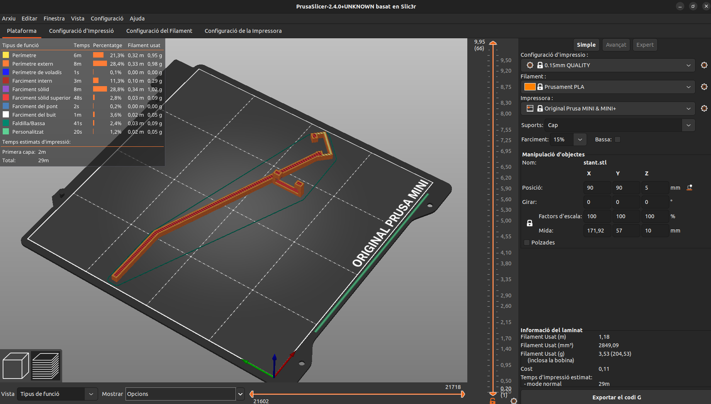

<p align="right"><a href="./README.md">Català</a> | <a href="./README-es.md">Español</a> | <a href="./README-en.md">English</a> | <a href="./README-cn.md">中文</a></p>

# HACKEPS REPTE EURECAT -  <a href="https://github.com/Applied-Artificial-Intelligence-Eurecat/hackeps/" id="top"><small>挑战</small></a>
---

</img>
## 1. 依赖

总体而言，我们唯一需要的依赖是使用 ```Docker``` 来执行包含每个任务相应依赖和代码的容器。

## 2. GitHub 行动

为了遵循良好的编码实践以便易于理解、维护和提高代码质量，我们在 GitHub 平台上实现了一个自动化系统，这样允许我们定义自定义工作流程来自动执行代码的 _linting_ 和格式化。

我们创建了一个 _YAML_ 文件在 _.github/workflows_，该文件用于使用 _autoyapf_ 工具自动格式化 _Python_ 代码。

执行步骤如下：

1. 检出分支。
2. 检查是否有在运行 _autoyapf_ 后被修改的文件。
3. 如果有修改的文件，将自动格式化代码。
4. 执行带有指定消息的 _commit_，然后使用由 _secrets.GITHUB_TOKEN_ 提供的访问令牌发送到仓库。

现在，对于每个我们发起的 pull request 请求，测试将自动通过，且按照 _Python_ 的 _PEP8_ 样式指南进行相应更改。

## 3. 任务

我们尽量使用了 ```Docker``` 来执行大多数任务，以减少客户端手动安装库和包，同时简化执行过程。

</img>

### 🌼 Margarida

执行代码：
```
./margarida # docker-compose up --build
```

Margarida 是我们做的第一个任务，因为我们有使用过 <i>MQTT</i> 协议经验 所以没有太大问题来生成一个代码读取指定主题，给定凭据。

### <p id="sec-tulipa">🌷 Tulipa</p>

执行代码：
- 将程序加载到 _ESP_ 中，并设置网络接入点的配置变量。例如，我们使用 _Visual Studio Code_ 的 _platform.io_ 扩展加载程序。
- 在将程序加载到 ESP 后，唯一需要做的就是将其连接到电力网络。程序应该使用指定的网络配置自动连接并重新连接到 _MQTT broker_。

虽然这不是我们第一次使用 _ESP_，但这是我们第一次将其与植物一起使用。我们发现了监测植物的潜力和难度。

此外，为了安装距离传感器，我们使用 3D 打印了一个根据我们的需求定制的支架。 </img>

### 🎋 Bambú

执行代码：
```
./bambu # docker-compose up --build
```

一旦容器打开，我们将在 8888 端口上拥有一个 _Jupyter Notebook_ 服务器，要访问它，打开我们信任的浏览器并转到 ```http://localhost:8888```，我们应该在那里有一个包含执行过程的 notebook 的目录。

尽管这不是我们第一次使用 _Python_ 库预处理数据，但检测 _outliers_ 的复杂性使事情有些复杂。

### 🥑 Alvocat

执行代码（与 <a href="#sec-tulipa">Tulipa</a> 相同）：
- 将程序加载到 _ESP_ 中，并设置网络接入点的配置变量。例如，我们使用 _Visual Studio Code_ 的 _platform.io_ 扩展加载程序。
- 在将程序加载到 _ESP_ 后，唯一需要做的就是将其连接到电力网络。程序应该使用指定的网络配置自动连接并重新连接到 _MQTT broker_。

此挑战除了将数据发送到 _MQTT broker_ 外，还增加了读取信号以启动或关闭灌溉植物的水泵。

### 🍑 Préssec

执行代码：
- 执行 <a href="#sec-tulipa">Tulipa</a> 的步骤（以获取要读取的数据）。
- ```./pressec # docker-compose up --build```

该容器获取传感器发送的数据（在这种情况下仅为 _Tulipa_ 的数据），并将其保存在 _time-series database_（_influxDB_）中，因为它被优化用于压缩此类型数据并且比 _SQL_ 数据库更快。然后，我们取出这些数据并使用 _Grafana_ 实时展示，可以在打开容器的 URL 上看到：```http://localhost:3000```。

---
<div align="center">
此项目根据 MIT 许可证发布。有关详细信息，请参见 <a href="./LICENSE.md">LICENSE</a> 文件。

由 <a href="https://github.com/bolis-bic/" target="_blank">bolis-bic</a> 用 ❤️ 制作

<a href="#top">返回顶部</a>
</div>