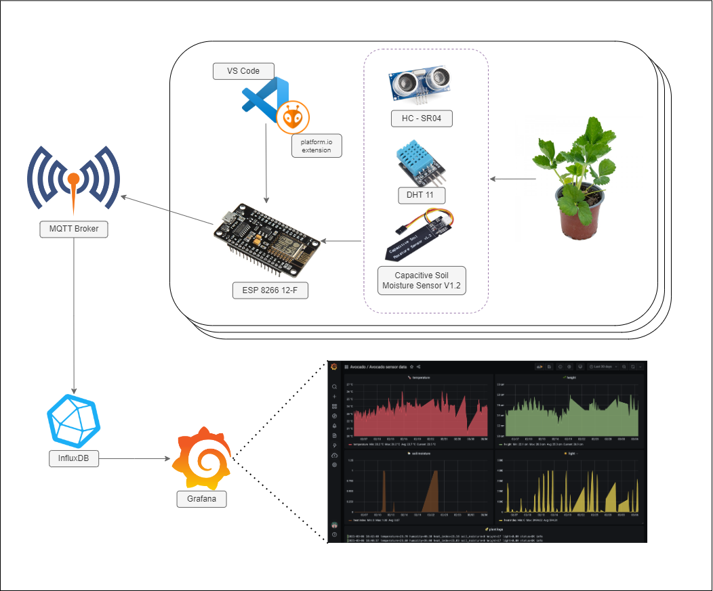
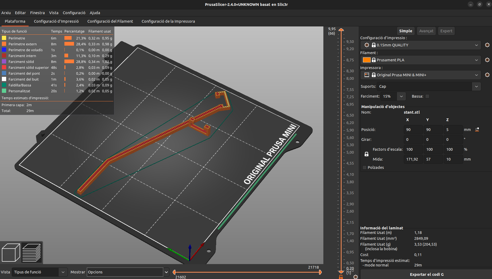

<p align="right"><a href="./README.md">Català</a> | <a href="./README-es.md">Español</a> | <a href="./README-en.md">English</a> | <a href="./README-cn.md">中文</a></p>

# HACKEPS RETO EURECAT -  <a href="https://github.com/Applied-Artificial-Intelligence-Eurecat/hackeps/" id="top"><small>reto</small></a>
---

</img>
## 1. Dependencias

En general, la única dependencia que necesitaremos es ```Docker``` para ejecutar los contenedores con las dependencias y el código correspondiente a cada misión.

## 2. GitHub Actions

Por la importancia de seguir unas buenas prácticas de programación para entender fácilmente, mantener y mejorar la calidad del código, hemos implementado un sistema de automatización integrado en la plataforma de GitHub que nos permitirá definir flujos de trabajo (workflows) personalizados para automatizar pruebas de _linting_ y el formateo del código.

Se ha creado un archivo _YAML_ en _.github/workflows_ que nos servirá para formatear automáticamente el código _Python_ utilizando la herramienta _autoyapf_.

Los pasos que sigue son:

1. Se realiza un checkout en la rama.
2. Se verifica si existen archivos modificados después de ejecutar _autoyapf_.
3. Si existen archivos modificados, se modifica automáticamente el código.
4. Se lleva a cabo un _commit_ con el mensaje indicado y después se envía al repositorio utilizando un token de acceso proporcionado por _secrets.GITHUB_TOKEN_.

De modo que ahora, para cada pull request que lanzamos, se pasará automáticamente el test y se realizarán los cambios pertinentes siguiendo el estándar de guías estilos _PEP8_ de _Python_.

## 3. Misiones

Hemos intentado realizar la mayoría de misiones utilizando ```Docker``` para minimizar las librerías y paquetes a instalar manualmente por parte del cliente, además de simplificar el proceso de ejecución.

</img>

### 🌼 Margarida

Para ejecutar el código:
```
./margarida # docker-compose up --build
```

Margarida fue la primera misión que hicimos, como tenemos experiencia utilizando el protocolo <i>MQTT</i> no fue demasiado problema generar un código que, con las credenciales dadas, lea del tópico pedido.

### <p id="sec-tulipa">🌷 Tulipa</p>

Para ejecutar el código:
- Cargar el programa en la _ESP_ poniendo las variables de configuración del punto de acceso a la red. Por ejemplo, nosotros lo cargamos con la extensión _platform.io_ de _Visual Studio Code_.
- A partir de haber cargado el programa en la _ESP_, lo único que falta es conectarla a la red eléctrica. El programa debería conectarse, y reconectar, automáticamente al _MQTT broker_ utilizando la configuración de red especificada.

No era nuestra primera vez trabajando con una _ESP_, pero sí que fue la primera vez utilizándola con una planta. Descubrimos el potencial y las dificultades de monitorizar una planta.

Además, para colocar un sensor de distancia imprimimos en 3D un soporte customizado a nuestras necesidades. </img>

### 🎋 Bambú 

Para ejecutar el código:
````
./bambu # docker-compose up --build
````

Una vez abierto el contenedor tendremos un servidor de _Jupyter Notebook_ en el puerto _8888_, para acceder a él abrimos nuestro navegador de confianza y vamos a la dirección ``http://localhost:8888``` donde deberíamos tener directorio con el notebook con los procedimientos realizados.

No era la primera vez que preprocesábamos datos con librerías de _Python_, aunque se nos complicó un poco la detección de _outliers_.

### 🥑 Alvocat

Para ejecutar el código (al igual que <a href="#sec-tulipa">Tulipa</a>):
- Cargar el programa en la _ESP_ poniendo las variables de configuración del punto de acceso a la red. Por ejemplo, nosotros lo cargamos con la extensión _platform.io_ de _Visual Studio Code_.
- A partir de haber cargado el programa en la _ESP_, lo único que falta es conectarla a la red eléctrica. El programa debería conectarse, y reconectar, automáticamente al _MQTT broker_ utilizando la configuración de red especificada.

Este reto, además de enviar datos al _MQTT broker_, añadía la lectura de una señal para activar o desactivar una bomba de agua para regar la planta.

### 🍑 Préssec

Para ejecutar el código:
- Ejecutar los pasos de <a href="#sec-tulipa">Tulipa</a> (para tener datos a leer).
- ```./presivo # docker-compose up --build```

Este contenedor toma los datos que envían los sensores (en este caso solo de _Tulipa_) y los guarda en una _time-series database_ (_influxDB_) porque está optimizada para comprimir los datos de este tipo y es más rápida que una base de datos _SQL_. Después, tomamos estos datos para representarlos en tiempo real con _Grafana_, los cuales podemos ver una vez abierto el contenedor en la URL: ```http://localhost:3000```.

---
<div align="center">
Este proyecto está bajo licencia del MIT. Para obtener más detalles, consulte el archivo <a href="./LICENSE.md">LICENSE</a>.

Hecho con ❤️ por <a href="https://github.com/bolis-bic/" target="_blank">bolis-bic</a>

<a href="#top">Volver arriba</a>
</div>